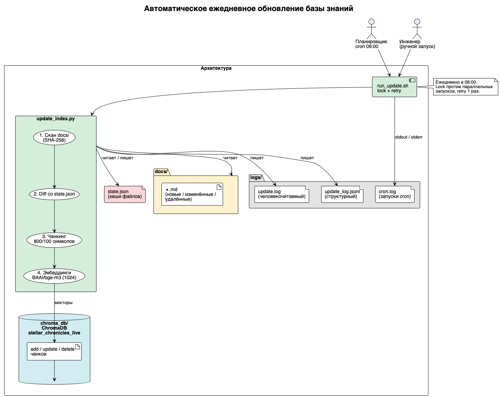

# Задание 6. Автоматическое ежедневное обновление базы знаний

Полностью автоматизированный инкрементальный пайплайн: скан источника → чанки → эмбеддинги → обновление индекса →
логирование. Запускается по cron.

## Файлы

| Файл                                           | Назначение                             |
|------------------------------------------------|----------------------------------------|
| [docs/](docs)                                  | Источник данных — 51 markdown-документ |
| [update_index.py](update_index.py)             | Инкрементальное обновление индекса     |
| [run_update.sh](run_update.sh)                 | Обёртка для cron (lock + retry)        |
| [crontab.txt](crontab.txt)                     | Готовая строка cron                    |
| [state.json](state.json)                       | Состояние: хеши файлов и число чанков  |
| [architecture.puml](architecture.puml)         | Диаграмма (PlantUML)                   |
| [logs/update.log](logs/update.log)             | Человекочитаемый лог                   |
| [logs/update_log.jsonl](logs/update_log.jsonl) | Структурный лог (JSONL)                |
| [logs/cron.log](logs/cron.log)                 | Лог запусков cron                      |
| [chroma_db/](chroma_db)                        | Векторный индекс (55 чанков)           |

## 1. Источник данных и «подхват» новых файлов

Источник — папка [docs/](docs). Новые документы просто кладутся в неё (или во вложенные папки).

«Подхват» реализован через **SHA-256** каждого файла:

- `state.json` хранит хеш и число чанков для каждого документа.
- При запуске скрипт сканирует `docs/`, считает хеши и сравнивает с прошлым состоянием:
    - **новый** файл — есть на диске, нет в состоянии → индексируется;
    - **изменённый** — хеш отличается → старые чанки удаляются, новые добавляются;
    - **удалённый** — есть в состоянии, нет на диске → чанки удаляются из индекса.

Хеш надёжнее mtime: переименование, смена прав или touch не создают ложных обновлений.

## 2. Скрипт обновления

[update_index.py](update_index.py) — единственная точка входа. Алгоритм:

1. Скан `docs/`, вычисление хешей.
2. Diff со [state.json](state.json) → списки added / modified / removed.
3. `collection.delete(where={"source": ...})` для removed и modified.
4. Чанкинг `RecursiveCharacterTextSplitter` (800 симв. / overlap 100).
5. Эмбеддинги `BAAI/bge-m3` (1024).
6. `collection.add(...)` с метаданными `source`, `title`, `chunk_index`.
7. Запись [state.json](state.json) и логов.

Индекс — ChromaDB, коллекция `stellar_chronicles_live`, метрика cosine.

## 3. Периодический запуск (cron)

Готовая строка — в [crontab.txt](crontab.txt):

```cron
0 6 * * * /bin/bash run_update.sh
```

Установка и проверка:

```bash
crontab crontab.txt     # установить задачу
crontab -l              # проверить
```

- **Частота:** каждый день в 06:00.
- **Запуск вручную:** `bash run_update.sh` или `python3 update_index.py`.
- **Обработка ошибок** ([run_update.sh](run_update.sh)):
    - lock-файл `logs/update.lock` — защита от параллельных запусков;
    - retry 1 раз через 30 сек при ненулевой код возврата;
    - весь stdout/stderr → [logs/cron.log](logs/cron.log);
    - ненулевой код завершения достаётся до cron (можно настроить mail/alert).

## 4. Логирование

Два формата одновременно:

**Человекочитаемый** — [logs/update.log](logs/update.log):

```
2026-09-22 12:19:22 [INFO] Scanned 51 files: 1 added, 1 modified, 0 removed.
2026-09-22 12:19:22 [INFO] index updated at 2026-09-22 12:19:22,
                          2 files changed, 2 chunks added, 0 errors,
                          index size 55 chunks, 13.98s.
```

**Структурный** — [logs/update_log.jsonl](logs/update_log.jsonl), по строке на запуск:

```json
{
  "timestamp": "2026-09-22T12:19:22",
  "files_added": 1,
  "files_modified": 1,
  "files_removed": 0,
  "new_chunks": 2,
  "index_size_chunks": 55,
  "errors": 0,
  "duration_seconds": 13.98
}
```

Пишутся: время старта/финиша, число новых/изменённых/удалённых файлов, число новых чанков, итоговый размер индекса,
ошибки, длительность.

## 5. Архитектурная диаграмма



Исходник: [architecture.puml](architecture.puml). Поток данных:

```
cron → run_update.sh → update_index.py
          docs/ ──► скан ──► diff(state.json) ──► чанкинг ──► эмбеддинги ──► chroma_db/
                                                        └──► logs/update.log, update_log.jsonl
     run_update.sh ──► logs/cron.log
```

## Тест обновления (выполнен)

Полный жизненный цикл проверен на реальном индексе:

| Сценарий         | Действие                                         | Результат                                |
|------------------|--------------------------------------------------|------------------------------------------|
| Первичная сборка | 50 файлов                                        | 50 added, 54 chunks, 0 errors            |
| Новый файл       | добавлен `HyperRelay.md` + изменён `Tatooine.md` | 1 added, 1 modified, 2 chunks, индекс 55 |
| Удаление         | удалён `TempDoc.md`                              | 1 removed, индекс 56 → 55                |

Проверка поиска нового документа: запрос «What powers a HyperRelay?» → `HyperRelay.md` (score 0.69) первым.

## Запуск с нуля

```bash
# 1. Положить документы в docs/
# 2. Построить/обновить индекс
python3 update_index.py
# 3. Поставить cron
crontab crontab.txt
```