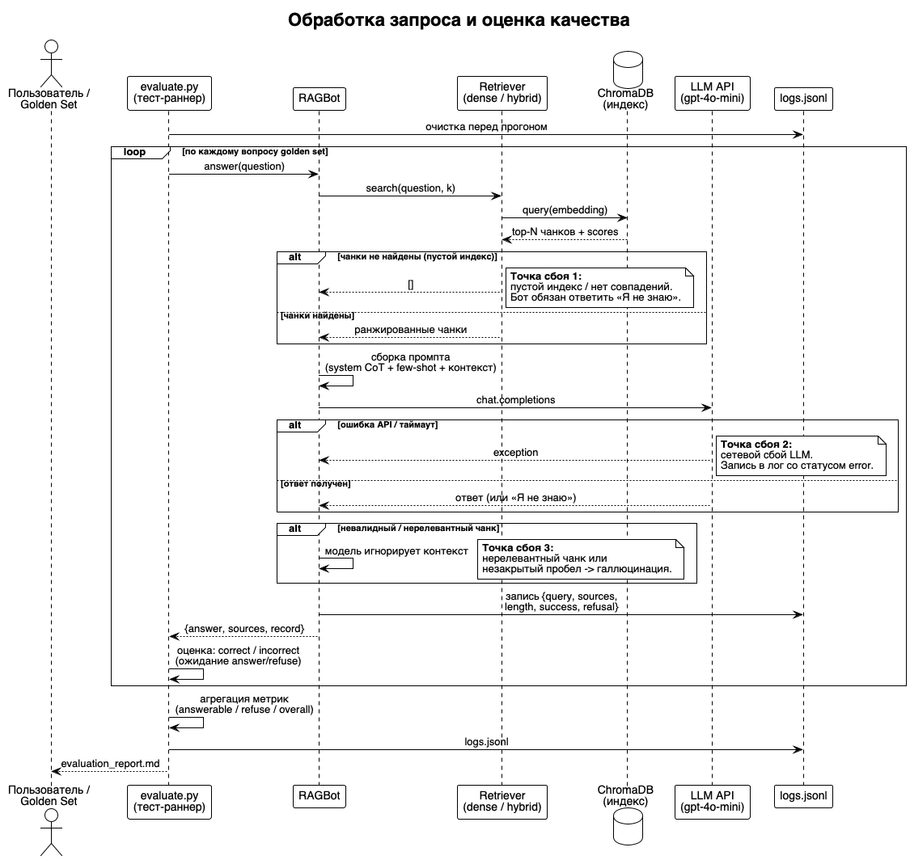

# Задание 7. Аналитика покрытия и качества базы знаний

Оценка полноты базы, выявление «слепых зон» бота и обоснованное улучшение покрытия через golden set и автотесты.

## Файлы

`logs.jsonl` с полями запрос / результат / источники / длина / статус                      
`golden_questions.txt` с ожидаемыми ответами                                               
Автотестирование индекса на «золотых» вопросах                                             
Скрипт автоматической проверки качества                                                    
Диаграмма на PlantUML

| Файл                                                                                          | Назначение                                                            |
|-----------------------------------------------------------------------------------------------|-----------------------------------------------------------------------|
| [logs.jsonl](logs.jsonl)                                                                      | `logs.jsonl` с полями запрос / результат / источники / длина / статус |
| [golden_questions.txt](golden_questions.txt)                                                  | `golden_questions.txt` с ожидаемыми ответами                          |
| [evaluate.py](evaluate.py) + [golden_questions.json](golden_questions.json)                   | Автотестирование индекса на «золотых» вопросах                        |
| [evaluate.py](evaluate.py)                                                                    | Скрипт автоматической проверки качества                               |
| [sequence.puml](sequence.puml)                                                                | Диаграмма на PlantUML                                                 |
| [create_gapped_kb.py](tools/create_gapped_kb.py)                                              | Вносит искусственные пробелы в базу                                   |
| [kb_gapped/](kb_gapped)                                                                       | «Дырявая» база (48 документов, 3 сущности удалены)                    |
| [apply_kb_fix.py](tools/apply_kb_fix.py)                                                      | Исправление найденной KB-несогласованности                            |
| [build_index.py](tools/build_index.py)                                                        | Сборка ChromaDB-индекса                                               |
| [rag_bot.py](rag_bot.py)                                                                      | RAG-бот + логирование запросов                                        |
| [hybrid_retriever.py](tools/hybrid_retriever.py)                                              | Гибридный поиск (dense + lexical)                                     |
| [make_golden.py](tools/make_golden.py)                                                        | Генератор golden set                                                  |
| [golden_questions.txt](golden_questions.txt) · [golden_questions.json](golden_questions.json) | Золотой набор вопросов                                                |
| [evaluate.py](evaluate.py)                                                                    | Автотест и оценка качества                                            |
| [logs.jsonl](logs.jsonl) · [logs_baseline.jsonl](logs_baseline.jsonl)                         | Логи запросов (improved / baseline)                                   |
| [eval_results.json](eval_results.json)                                                        | Метрики и результаты                                                  |
| [evaluation_report.md](evaluation_report.md)                                                  | Читаемый отчёт                                                        |
| [sequence.puml](sequence.puml) · [sequence.png](sequence.png)                                 | Диаграмма последовательности                                          |
| [chroma_db/](chroma_db)                                                                       | Векторный индекс                                                      |

## 1. Искусственные пробелы

[create_gapped_kb.py](tools/create_gapped_kb.py) удаляет 3 ключевые сущности — не только отдельные документы, но и все
упоминания в остальных файлах (иначе пробел был бы неполным):

| Сущность                   | Что удалено                       |
|----------------------------|-----------------------------------|
| **Zarn Velkor** (персонаж) | `Darth_Vader.md` + все упоминания |
| **Synth Flux** (концепт)   | `The_Force.md` + все упоминания   |
| **Kaelos** (планета)       | `Tatooine.md` + все упоминания    |

Результат: 51 → 48 документов, 7 файлов переписаны (упоминания вырезаны). Проверено: `grep` не находит ни одной из трёх
сущностей.

## 2. Логирование запросов

[rag_bot.py](rag_bot.py) пишет каждое обращение в [logs.jsonl](logs.jsonl) (JSONL, по строке на запрос). Обязательные
поля:

| Поле      | Описание                                                 |
|-----------|----------------------------------------------------------|
| `query`   | Запрос                                                   |
| `result`  | Результат — ответ бота                                   |
| `sources` | Источники (найденные чанки)                              |
| `length`  | Длина ответа                                             |
| `status`  | Статус: `ok` / `refused` / `no_context` / `short_answer` |

Дополнительные поля: `timestamp`, `found_chunks`, `n_chunks`, `refusal`, `top_scores`.

Распределение статусов в [logs.jsonl](logs.jsonl): `ok` — 8, `refused` — 5.

## 3. Золотой набор

[golden_questions.txt](golden_questions.txt) — 13 вопросов, у каждого есть **ожидаемый ответ**:

- **8 известных** (бот должен ответить): Dorin Venn, Void Core, Aether Guard, HyperRelay, Sheev Malachar, Void Cabal,
  Torin Mellis, Zephyr. У каждого — эталонный ответ и ключевые слова.
- **5 на пробелы** (бот должен отказаться): Zarn Velkor, Synth Flux, Kaelos, а также где вырос Dorin Venn. Ожидаемый
  ответ — «Я не знаю».

Машинная версия набора — [golden_questions.json](golden_questions.json) (поля `expected`, `expected_answer`,
`keywords`).

## 4. Автоматическое тестирование

[evaluate.py](evaluate.py) прогоняет golden set в двух режимах и сравнивает:

1. **Baseline** — dense-поиск (bge-m3 + ChromaDB).
2. **Improved** — гибридный поиск (dense + лексический rerank).

Оценка корректности: для `answer` — не отказ и наличие ключевого слова; для `refuse` — детекция «Я не знаю».

## 5. Анализ и улучшение покрытия

### Результаты

| Метрика            | Baseline (dense) | Improved (hybrid) |
|--------------------|------------------|-------------------|
| Известные темы     | 7/8 (0.875)      | **8/8 (1.0)**     |
| Отказы (пробелы)   | 5/5 (1.0)        | 5/5 (1.0)         |
| **Общая точность** | 12/13 (0.923)    | **13/13 (1.0)**   |

### Найденные проблемы

**1. Отказы на пробелах работают корректно.** Все 5 вопросов об удалённых сущностях → бот честно отвечает «Я не знаю».
Механизм выявления пробелов (запрос → нет чанков → отказ) подтверждён.

**2. Несогласованность имён (наследие Задания 2).** Термины заменялись по полной строке, из-за чего в базе остались
фрагменты исходных имён:

- `Obi-Wan "Ben" Mellis` — сущность **Torin Mellis** не была описана → бот не отвечал.
- `Sheev Malachar` против вопроса про `Overlord Malachar` — имя не совпадало.
- В ответах проскакивает `Luke Skywalker` вместо `Dorin Venn`.

**3. Слабость dense-поиска на коротких запросах.** «Кто такой Zephyr?» не поднял `Yoda.md` (dense-скор 0.12): документы
начинаются одинаково («X is a fictional character…»), и редкое имя не доминирует в эмбеддинге.

### Применённые улучшения

| Проблема               | Решение                                      | Код                                              |
|------------------------|----------------------------------------------|--------------------------------------------------|
| Torin Mellis не описан | Переписан документ под единое имя            | [apply_kb_fix.py](tools/apply_kb_fix.py)         |
| Короткие запросы       | Гибридный поиск `0.6·dense + 0.4·lexical`    | [hybrid_retriever.py](tools/hybrid_retriever.py) |
| Плавающий G5           | `temperature=0` для детерминированной оценки | [rag_bot.py](rag_bot.py)                         |

Гибридный поиск поднял `Yoda.md` (Zephyr) с 0.12 до первого места, `Palpatine.md` (Malachar) — в топ-3.

### Рекомендации по доработке базы

1. **Валидация terms_map** — проверять, что все вхождения термина (включая части имён) заменены.
2. **Aliases** — хранить синонимы сущностей (`Overlord Malachar` = `Sheev Malachar`) в метаданных.
3. **Гибридный поиск** — включить в основной пайплайн (в Задании 4 был только dense).
4. **Регулярный golden-прогон** — запускать [evaluate.py](evaluate.py) в CI после каждого обновления индекса (Задание
   6).

## 6. Диаграмма последовательности



Исходник — [sequence.puml](sequence.puml). Показаны обработка запроса, процесс оценки и три точки сбоя:

1. **Пустой индекс** — нет чанков → бот отвечает «Я не знаю».
2. **Сбой LLM** — ошибка API → запись в лог со статусом ошибки.
3. **Нерелевантный чанк** — модель игнорирует контекст → риск галлюцинации.

## Запуск

```bash
python3 create_gapped_kb.py    # внести пробелы
python3 apply_kb_fix.py        # применить KB-фикс
python3 build_index.py         # собрать индекс
python3 make_golden.py         # сгенерировать golden set
python3 evaluate.py            # прогнать автотест и сравнить режимы
```

Требуется `AITUNNEL_API_KEY`.